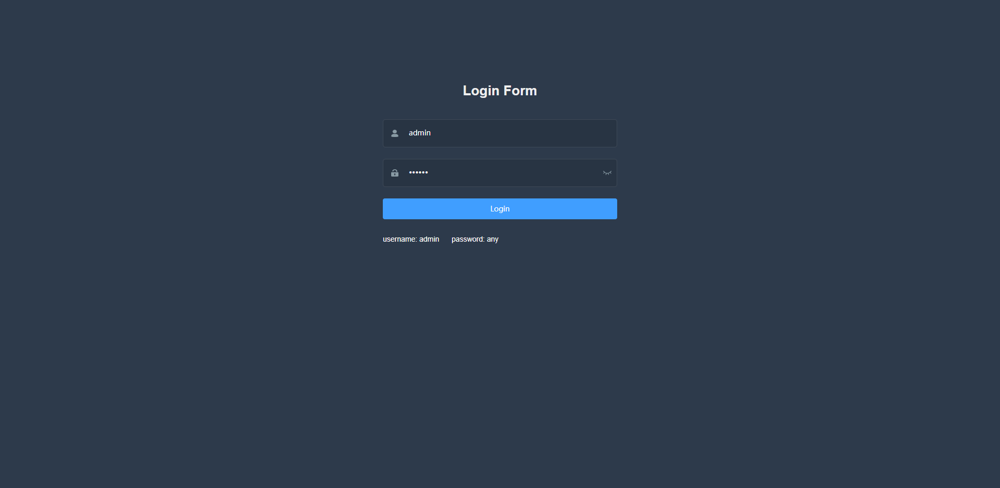
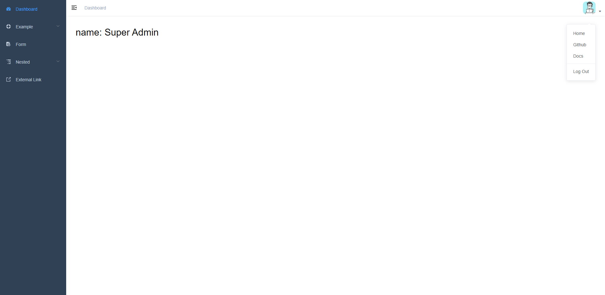
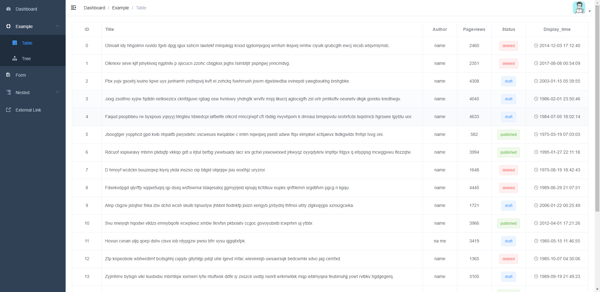

## font-end
> src/main/resources/fontend 存放着 `vue-admin-template` 前端项目，内容可参考
>https://panjiachen.github.io/vue-element-admin-site/zh/

## back-end
> 参考书籍《SpringBoot + vue 全栈开发》

## 使用
进入 src/main/resources/fontend/vue-admin-template
```text
  # 构建测试环境
  npm run build:stage
     
  # 构建生产环境
  npm run build:prod
```
生成的文件位于 src/main/resources/fontend/vue-admin-template/dist 下,拷贝 dist 中的内容放入 src/main/resources/static 下即可


## 样例








## 更新记录

- 2020-06-14

  > 文件上传功能完成
  
- 2020-06-13

  > 新增 `freemarker` 的使用